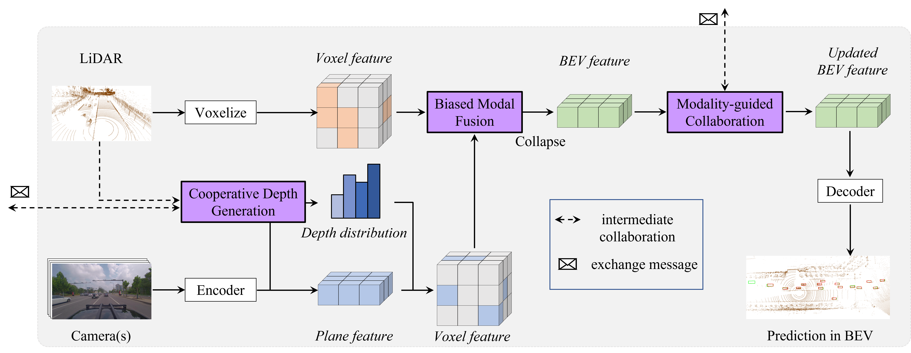

# BM2CP
[CoRL 2023] BM2CP: Efficient Collaborative Perception with LiDAR-Camera Modalities

## Overview

**Abstract:** Collaborative perception enables agents to share complementary perceptual information with nearby agents. This can significantly benefit the perception performance and alleviate the issues of single-view perception, such as occlusion and sparsity. Most proposed approaches mainly focus on single modality (especially LiDAR), and not fully exploit the superiority of multi-modal perception. We propose an collaborative perception paradigm, BM2CP, which employs LiDAR and camera to achieve efficient multi-modal perception. BM2CP utilizes LiDAR-guided modal fusion, cooperative depth generation and modality-guided intermediate fusion to acquire deep interactions between modalities and agents. Moreover, it is capable to cope with the special case that one of the sensors is unavailable. Extensive experiments validate that it outperforms the state-of-the-art methods with 50X lower communication volumes in real-world autonomous driving scenarios.


## Updates
- 2024/01/28 Support OPV2V dataset. Support SCOPE(ICCV2023). Fix bugs in fusion dataset that cause abnormal performance in presence of pose error. 
- 2023/11/30 First version.


## Features

- Dataset Support
  - [x] OPV2V
  - [ ] V2XSet
  - [ ] V2X-Sim 2.0
  - [x] DAIR-V2X
  - [ ] V2V4Real (Only LiDAR released by Official)

- Spconv Support
  - [x] 1.2.1
  - [x] 2.x

- SOTA collaborative perception method support
    - [x] Late Fusion
    - [x] Early Fusion
    - [x] [When2com (CVPR2020)](https://arxiv.org/abs/2006.00176)
    - [x] [V2VNet (ECCV2020)](https://arxiv.org/abs/2008.07519)
    - [x] [DiscoNet (NeurIPS2021)](https://arxiv.org/abs/2111.00643)
    - [x] [V2X-ViT (ECCV2022)](https://arxiv.org/abs/2203.10638)
    - [x] [CoBEVT (CoRL2022)](https://arxiv.org/abs/2207.02202)
    - [x] [Where2comm (NeurIPS2022)](https://arxiv.org/abs/2209.12836)
    - [x] [CoAlign (ICRA2023)](https://arxiv.org/abs/2211.07214)
    - [x] [BM2CP (CoRL2023)](https://arxiv.org/abs/2310.14702) (Coming soon for OPV2V dataset)
    - [x] [SCOPE (ICCV2023)](https://arxiv.org/abs/2307.13929)
    - [ ] How2comm (NeurIPS2023) Coming soon ...

- Visualization
  - [x] BEV visualization
  - [x] 3D visualization


## Quick Start
#### Download dataset 
##### 1. OPV2V
Download raw data of [OPV2V](https://drive.google.com/drive/folders/1dkDeHlwOVbmgXcDazZvO6TFEZ6V_7WUu) relseased by Official.
##### 2. DAIR-V2X
1. Download raw data of [DAIR-V2X](https://thudair.baai.ac.cn/cooptest).
2. Download complemented annotation from [Yifan Lu](https://github.com/yifanlu0227/CoAlign).

#### Install
Please refer to the [INSTALL.md](./INSTALL.md) for detailed documentations. 


#### Train your model
First of all, modify the dataset path in the setting file, i.e. `xxx.yaml`.
```
data_dir: "{YOUR PATH}/DAIR-V2X-C/cooperative-vehicle-infrastructure"
root_dir: "{YOUR PATH}/DAIR-V2X-C/cooperative-vehicle-infrastructure/train.json"
validate_dir: "{YOUR PATH}/DAIR-V2X-C/cooperative-vehicle-infrastructure/val.json"
test_dir: "{YOUR PATH}/DAIR-V2X-C/cooperative-vehicle-infrastructure/val.json"
```

The setting is same as OpenCOOD, which uses yaml file to configure all the parameters for training. To train your own model from scratch or a continued checkpoint, run the following commonds:
```python
python opencood/tools/train.py --hypes_yaml ${CONFIG_FILE} [--model_dir  ${CHECKPOINT_FOLDER}]
```
Arguments Explanation:
- `hypes_yaml`: the path of the training configuration file, e.g. `opencood/hypes_yaml/second_early_fusion.yaml`, meaning you want to train
an early fusion model which utilizes SECOND as the backbone. See [Tutorial 1: Config System](https://opencood.readthedocs.io/en/latest/md_files/config_tutorial.html) to learn more about the rules of the yaml files.
- `model_dir` (optional) : the path of the checkpoints. This is used to fine-tune the trained models. When the `model_dir` is given, the trainer will discard the `hypes_yaml` and load the `config.yaml` in the checkpoint folder.

For example, to train BM2CP from scratch:
```
python opencood/tools/train.py --hypes_yaml opencood/hypes_yaml/dair-v2x/dair_bm2cp.yaml
```

To train BM2CP from a checkpoint:
```
python opencood/tools/train.py --hypes_yaml opencood/hypes_yaml/dair-v2x/dair_bm2cp.yaml --model_dir opencood/logs/dair_bm2cp_2023_11_28_08_52_46
```

#### Test the model
Before you run the following command, first make sure the `validation_dir` in config.yaml under your checkpoint folder
refers to the testing dataset path, e.g. `opv2v_data_dumping/test`.

```python
python opencood/tools/inference.py --model_dir ${CHECKPOINT_FOLDER} --fusion_method ${FUSION_STRATEGY} --eval_epoch ${epoch_number} --save_vis ${default False}
```
Arguments Explanation:
- `model_dir`: the path to your saved model.
- `fusion_method`: indicate the fusion strategy, currently support 'early', 'late', 'intermediate', 'no'(indicate no fusion, single agent), 'intermediate_with_comm'(adopt intermediate fusion and output the communication cost).
- `eval_epoch`: int. Choose to inferece which epoch.
- `save_vis`: bool. Wether to save the visualization result.

The evaluation results  will be dumped in the model directory.

## Acknowledgements
Thank for the excellent cooperative perception codebases [OpenCOOD](https://github.com/DerrickXuNu/OpenCOOD), [CoPerception](https://github.com/coperception/coperception) and [Where2comm](https://github.com/MediaBrain-SJTU/Where2comm).

Thank for the excellent cooperative perception datasets [DAIR-V2X](https://thudair.baai.ac.cn/index), [OPV2V](https://mobility-lab.seas.ucla.edu/opv2v/) and [V2X-SIM](https://ai4ce.github.io/V2X-Sim/).

Thank for the dataset and code support by [DerrickXu](https://github.com/DerrickXuNu), [Yue Hu](https://github.com/MediaBrain-SJTU) and [YiFan Lu](https://github.com/yifanlu0227).

## Relevant Projects

Thanks for the insightful previous works in cooperative perception field.

### Methods

**V2VNet: Vehicle-to-vehicle communication for joint perception and prediction** 
*ECCV20* [[Paper]](https://arxiv.org/abs/2008.07519) 

**When2com: Multi-agent perception via communication graph grouping** 
*CVPR20* [[Paper]](https://arxiv.org/abs/2006.00176) [[Code]](https://arxiv.org/abs/2006.00176)

**Learning Distilled Collaboration Graph for Multi-Agent Perception** 
*NeurIPS21* [[Paper]](https://arxiv.org/abs/2111.00643) [[Code]](https://github.com/DerrickXuNu/OpenCOOD)

**V2X-ViT: Vehicle-to-Everything Cooperative Perception with Vision Transformer** *ECCV2022* [[Paper]](https://arxiv.org/abs/2203.10638) [[Code]](https://github.com/DerrickXuNu/v2x-vit) [[Talk]](https://course.zhidx.com/c/MmQ1YWUyMzM1M2I3YzVlZjE1NzM=)

**Self-Supervised Collaborative Scene Completion: Towards Task-Agnostic Multi-Robot Perception** 
*CoRL2022* [[Paper]](https://openreview.net/forum?id=hW0tcXOJas2)

**CoBEVT: Cooperative Bird's Eye View Semantic Segmentation with Sparse Transformers** *CoRL2022* [[Paper]](https://arxiv.org/abs/2207.02202) [[Code]](https://github.com/DerrickXuNu/CoBEVT)

**Where2comm: Communication-Efficient Collaborative Perception via Spatial Confidence Maps** *NeurIPS2022* [[Paper]](https://arxiv.org/abs/2209.12836) [[Code]](https://github.com/MediaBrain-SJTU/Where2comm)

**Spatio-Temporal Domain Awareness for Multi-Agent Collaborative Perception** *ICCV2023* [[Paper]](https://arxiv.org/abs/2307.13929)[[Code]](https://github.com/starfdu1418/SCOPE)
### Datasets

**OPV2V: An Open Benchmark Dataset and Fusion Pipeline for Perception with Vehicle-to-Vehicle Communication** 
*ICRA2022* [[Paper]](https://arxiv.org/abs/2109.07644) [[Website]](https://mobility-lab.seas.ucla.edu/opv2v/) [[Code]](https://github.com/DerrickXuNu/OpenCOOD)

**V2X-Sim: A Virtual Collaborative Perception Dataset and Benchmark for Autonomous Driving** 
*RAL21* [[Paper]](https://arxiv.org/abs/2111.00643) [[Website]](https://ai4ce.github.io/V2X-Sim/)[[Code]](https://github.com/ai4ce/V2X-Sim)

**DAIR-V2X: A Large-Scale Dataset for Vehicle-Infrastructure Cooperative 3D Object Detection** *CVPR2022* [[Paper]](https://arxiv.org/abs/2204.05575) [[Website]](https://thudair.baai.ac.cn/index) [[Code]](https://github.com/AIR-THU/DAIR-V2X)

